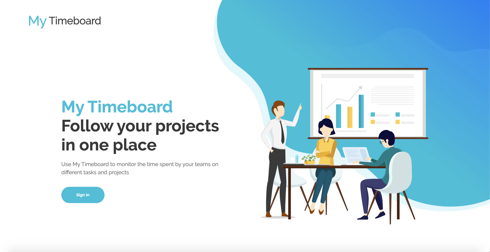

# Presentation

Our solution is a project management platform allowing to answer the following issues:
- Finely manage the resources participating in a project
- Estimate precisely the cost of an employee
- Suggest a timesheets workflow validation

# Documentations

- [Software design](docs/design.md)

- [See setup dev env manual](docs/setup.md)

- [Dev cheatsheet](docs/cheatsheet.md)
         
 
# Screenshots

