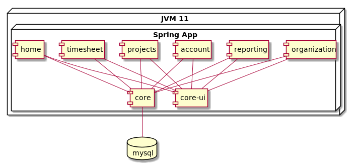

# Technical Overview

## Big picture

Kronops is based on Apache Karaf Runtime.

All Kronops runtime dependencies can be found in Karaf [feature.xml](../features/src/main/feature/feature.xml) file

## Technical stack

### Server side

- Java JDK 11
- Apache Karaf 2.4.6
- OSGI R6
- Hibernate

### Client side 

- Thymeleaf
- Semantic-UI

## Kronops components

- Core : business logic
- Core-ui : runtime framework for web ui
- Home : landing page, display graphs and user activities
- Projects : projects, tasks and clusters setup pages
- Timesheet : page used to note effort spent on projects
- Security : brind software security (filters, login form)
- Shell : custom karaf shell commands for Kronops

## Functionnal basics

### Actor

Any logged user to Kronops is an actor

### Project

A project is a set of tasks. Actors can be projet's member.
Each project member (an actor) as a project role.

Project role is used to allow or not some actions on project.

### Task

A task is time based job. A Task as a start date, a stop date and and original effort.
A task is assigned to a unique Actor.

### Project Clusters

Project Clusters is a tree of project. This concept is used to group project for reporting generation.

A project can be referenced by several project clusters.

